# Lab 44: Citus Cluster Provisioning

Citus is an open-source extension to PostgreSQL that transforms it into a distributed database, enabling horizontal scaling across multiple servers while retaining standard PostgreSQL features and full ACID compliance. It is purpose-built for multi-tenant SaaS architectures, real-time dashboards, and high-throughput time-series workloads.

<p align="center">
  
</p>

---

## Core Architecture

A Citus cluster operates on a **Coordinator–Worker** model:

1. **Coordinator Node:** Acts as the primary entry point. Clients and web applications (e.g., Flask) connect only to the coordinator. It manages distributed metadata, determines data distribution paths, rewrites incoming SQL queries, and coordinates execution across worker nodes.
2. **Worker Nodes:** PostgreSQL instances running the Citus extension that hold actual data shards. Workers run query fragments concurrently in parallel processes and return partial results to the coordinator.

```text
               +-----------------------------+
               |      Flask Application      |
               +-----------------------------+
                              |
                     SQL (port 5432)
                              v
               +-----------------------------+
               |      Citus Coordinator      |
               |      (Private: 10.0.1.10)   |
               +-----------------------------+
                 /           |           \
         Router /     Router |     Router \
               v             v             v
       +-------------+ +-------------+ +-------------+
       |  Worker 0   | |  Worker 1   | |  Worker 2   |
       |  10.0.1.20  | |  10.0.1.21  | |  10.0.1.22  |
       +-------------+ +-------------+ +-------------+
```

---

## Data Distribution Models

| Table Type | Description | Best Use Case | SQL Command |
|---|---|---|---|
| **Distributed Table** | Rows are hashed and divided into shards across workers based on a distribution column. | High-growth, multi-tenant tables (`orders`, `events`). | `create_distributed_table('table', 'col')` |
| **Reference Table** | Fully duplicated in full on every worker node for instant local joins. | Small lookup tables (`products`, `categories`). | `create_reference_table('table')` |
| **Local Table** | Normal PostgreSQL table that stays exclusively on the coordinator. | Administrative data, local schemas. | Standard `CREATE TABLE` |

---

## Hands-On Lab Walkthrough

This guide provides a comprehensive step-by-step walkthrough to provision a 4-node Citus cluster on AWS using Pulumi and Docker Compose. Every step includes the exact code, detailed explanations, and terminal screenshots.

---

### Step 1: Obtain Credentials & Configure AWS CLI

First, view your AWS credentials from the **Credentials** panel on the right side of the Poridhi interface:

<p align="center">
  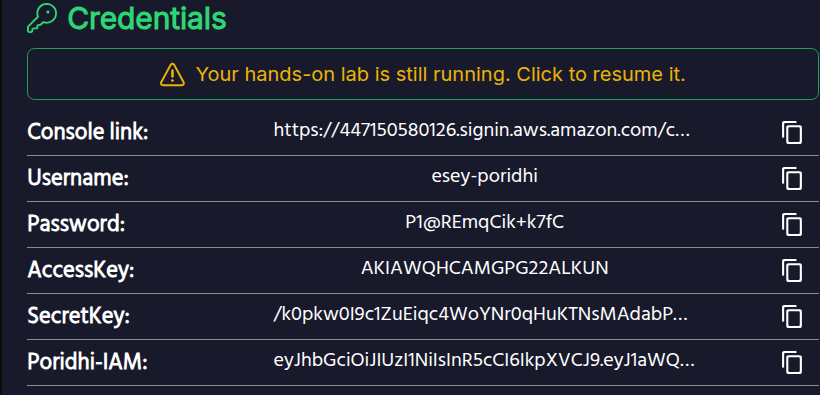
</p>

To prevent accidental key swapping in interactive prompts, configure the AWS CLI non-interactively:

```bash
aws configure set aws_access_key_id "YOUR_ACCESS_KEY_HERE"
aws configure set aws_secret_access_key "YOUR_SECRET_KEY_HERE"
aws configure set default.region "ap-southeast-1"
aws configure set default.output "json"
```

<p align="center">
  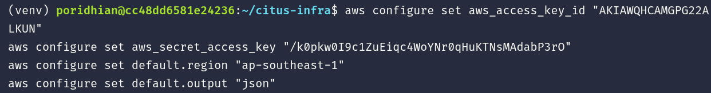
</p>

Now verify that AWS successfully authenticates your session:

```bash
aws sts get-caller-identity
```

<p align="center">
  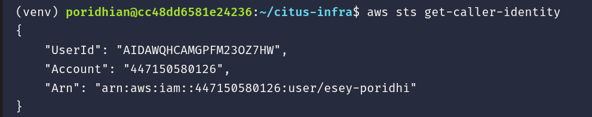
</p>

**Expected Output:**
```json
{
    "UserId": "AIDAWQHCAMGPFM230Z7HW",
    "Account": "447150580126",
    "Arn": "arn:aws:iam::447150580126:user/esey-poridhi"
}
```

---

### Step 2: Set Up Workspace and Python Virtual Environment

Create an isolated directory `citus-infra` and initialize a Python virtual environment:

```bash
mkdir -p ~/citus-infra
cd ~/citus-infra

sudo apt update && sudo apt install -y python3-venv python3-pip
python3 -m venv venv
source venv/bin/activate
```

<p align="center">
  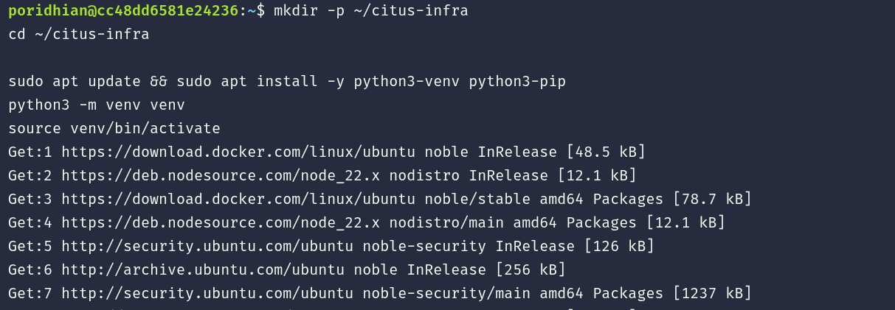
</p>

**Expected Output:**
The shell prompt indicates the active virtual environment:
```text
(venv) poridhian@...:~/citus-infra$
```

---

### Step 3: Set Up Pulumi Account & Generate Access Token

Pulumi manages our cloud infrastructure using Python code.

1. Open **[https://app.pulumi.com](https://app.pulumi.com)** in your browser and select **Continue with Google** or **Continue with GitHub**:

<p align="center">
  
</p>

2. When prompted for workspace type, select **"I'm working on a personal project"** and click **Continue**:

<p align="center">
  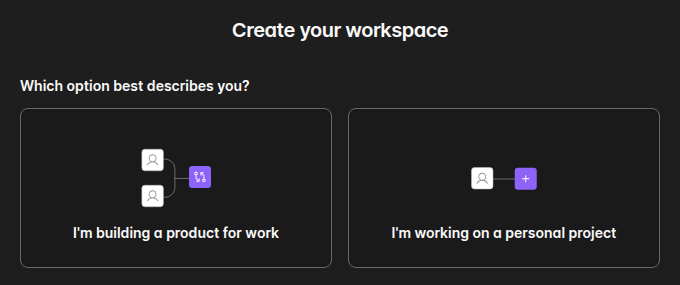
</p>

3. In the onboarding survey, click **Skip** at the bottom:

<p align="center">
  
</p>

4. Open the Access Tokens page at **[https://app.pulumi.com/user/settings/tokens](https://app.pulumi.com/user/settings/tokens)**. Click **Create token**, type description `citus-lab`, and copy the generated token:

<p align="center">
  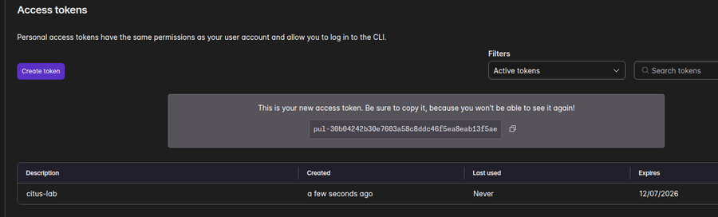
</p>

5. In the Poridhi terminal, export your token and log in directly:

```bash
export PULUMI_ACCESS_TOKEN="YOUR_PULUMI_TOKEN_HERE"
pulumi login
```

<p align="center">
  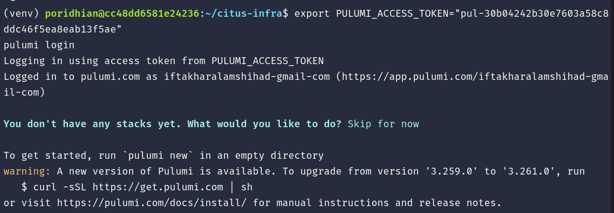
</p>

**Expected Output:**
```text
Logging in using access token from PULUMI_ACCESS_TOKEN
Logged in to pulumi.com as iftakharalamshihad-gmail-com (https://app.pulumi.com/iftakharalamshihad-gmail-com)

You don't have any stacks yet. What would you like to do? Skip for now

To get started, run `pulumi new` in an empty directory
```

---

### Step 4: Initialize the Pulumi Project

Initialize the AWS Python project. We pass `--force` because the `venv` directory is already present in `~/citus-infra`:

```bash
cd ~/citus-infra
pulumi new aws-python --force
```

Follow the interactive prompts:
* **Project name:** Press **Enter** (defaults to `citus-infra`)
* **Project description:** Press **Enter**
* **Stack name:** Press **Enter** (defaults to `dev`)
* **Toolchain:** Select **`pip`** and press **Enter**
* **The AWS region to deploy into (aws:region):** Type **`ap-southeast-1`** and press **Enter**

<p align="center">
  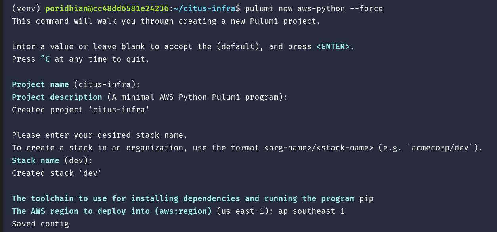
</p>

**Expected Output:**
```text
Finished installing dependencies
Your new project is ready to go!
```

---

### Step 5: Create AWS SSH Key Pair

Create an SSH key pair named `citus-key` so that we can connect to the coordinator and workers (ensure the `~/.ssh` directory exists first with `mkdir -p ~/.ssh`):

```bash
# 1. Remove the old locked file and delete AWS key
rm -f ~/.ssh/citus-key.pem
aws ec2 delete-key-pair --key-name citus-key 2>/dev/null || true

# 2. Generate the new key pair and secure it
aws ec2 create-key-pair --key-name citus-key --output text --query 'KeyMaterial' > ~/.ssh/citus-key.pem
chmod 400 ~/.ssh/citus-key.pem

# 3. Verify key file exists
ls -l ~/.ssh/citus-key.pem
```

<p align="center">
  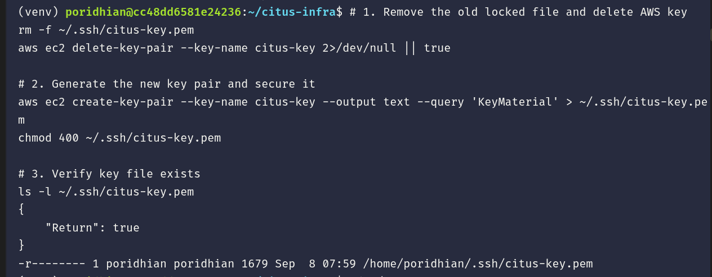
</p>

**Expected Output:**
```text
{
    "Return": true
}
-r-------- 1 poridhian poridhian 1679 Sep  8 07:59 /home/poridhian/.ssh/citus-key.pem
```

---

### Step 6: Define Infrastructure in `__main__.py`

> [!IMPORTANT]
> Always set `instance_type = "t2.micro"`. In educational AWS environments, larger sizes like `t2.small` will trigger an immediate IAM `403 UnauthorizedOperation` deny.

Write the complete infrastructure definition into `__main__.py`:

```bash
cd ~/citus-infra

cat << 'EOF' > __main__.py
import pulumi
import pulumi_aws as aws
import os

instance_type = "t2.small"
ami_id = "ami-01811d4912b4ccb26"
key_name = "citus-key"

# 1. Networking (VPC, Subnet, Gateway, Route Table)
vpc = aws.ec2.Vpc("citus-vpc", cidr_block="10.0.0.0/16", enable_dns_hostnames=True, enable_dns_support=True, tags={"Name": "citus-vpc"})
igw = aws.ec2.InternetGateway("citus-igw", vpc_id=vpc.id, tags={"Name": "citus-igw"})
subnet = aws.ec2.Subnet("citus-subnet", vpc_id=vpc.id, cidr_block="10.0.1.0/24", map_public_ip_on_launch=True, tags={"Name": "citus-subnet"})
route_table = aws.ec2.RouteTable("citus-rt", vpc_id=vpc.id, routes=[aws.ec2.RouteTableRouteArgs(cidr_block="0.0.0.0/0", gateway_id=igw.id)], tags={"Name": "citus-rt"})
route_table_assoc = aws.ec2.RouteTableAssociation("citus-rt-assoc", subnet_id=subnet.id, route_table_id=route_table.id)

# 2. Security Group
security_group = aws.ec2.SecurityGroup("citus-sg", vpc_id=vpc.id, description="Security group for Citus cluster",
    ingress=[
        aws.ec2.SecurityGroupIngressArgs(protocol="tcp", from_port=22, to_port=22, cidr_blocks=["0.0.0.0/0"]),
        aws.ec2.SecurityGroupIngressArgs(protocol="tcp", from_port=5432, to_port=5432, cidr_blocks=["10.0.0.0/16"]),
    ],
    egress=[aws.ec2.SecurityGroupEgressArgs(protocol="-1", from_port=0, to_port=0, cidr_blocks=["0.0.0.0/0"])],
    tags={"Name": "citus-sg"}
)

# 3. Docker Startup Script
user_data = """#!/bin/bash
apt update && apt upgrade -y
apt install -y docker.io docker-compose
systemctl enable docker
systemctl start docker
"""

# 4. Coordinator Node (10.0.1.10)
coordinator = aws.ec2.Instance("citus-coordinator", instance_type=instance_type, ami=ami_id, subnet_id=subnet.id,
    vpc_security_group_ids=[security_group.id], key_name=key_name, user_data=user_data, associate_public_ip_address=True,
    private_ip="10.0.1.10", tags={"Name": "citus-coordinator"}, opts=pulumi.ResourceOptions(depends_on=[route_table_assoc, subnet]))

# 5. 3 Worker Nodes (10.0.1.20, 10.0.1.21, 10.0.1.22)
workers = [
    aws.ec2.Instance(f"citus-worker-{i}", instance_type=instance_type, ami=ami_id, subnet_id=subnet.id,
        vpc_security_group_ids=[security_group.id], key_name=key_name, user_data=user_data, associate_public_ip_address=True,
        private_ip=f"10.0.1.2{i}", tags={"Name": f"citus-worker-{i}"}, opts=pulumi.ResourceOptions(depends_on=[route_table_assoc, subnet]))
    for i in range(3)
]

# 6. Outputs & SSH Config
pulumi.export('controller_public_ips', [coordinator.public_ip])
pulumi.export('controller_private_ips', [coordinator.private_ip])
pulumi.export('worker_public_ips', [w.public_ip for w in workers])
pulumi.export('worker_private_ips', [w.private_ip for w in workers])
pulumi.export('vpc_id', vpc.id)
pulumi.export('subnet_id', subnet.id)

def create_config_file(ip_list):
    hostnames = ['controller-0', 'worker-0', 'worker-1', 'worker-2']
    config_content = "".join([f"Host {h}\n    HostName {ip}\n    User ubuntu\n    IdentityFile ~/.ssh/{key_name}.pem\n\n" for h, ip in zip(hostnames, ip_list)])
    with open(os.path.expanduser("~/.ssh/config"), "w") as f:
        f.write(config_content)

pulumi.Output.all(*([coordinator.public_ip] + [w.public_ip for w in workers])).apply(create_config_file)
EOF
```

<p align="center">
  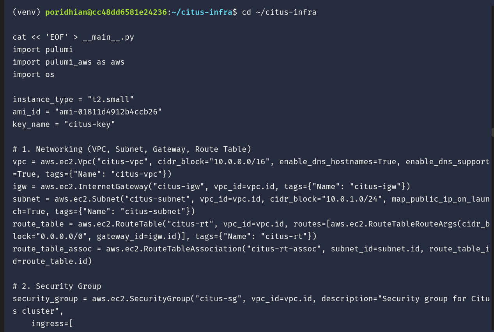
</p>

Verify that the file wrote cleanly to the end:

```bash
tail -n 5 __main__.py
```

<p align="center">
  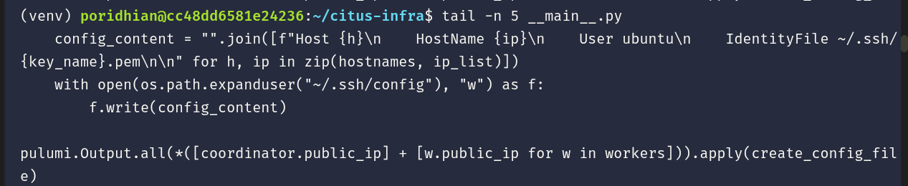
</p>

---

### Step 7: Provision the Cluster on AWS

Deploy all resources using `pulumi up`:

> [!IMPORTANT]
> In Poridhi's AWS sandbox, the IAM permission policy restricts EC2 instance types to `t2.micro`. If left as `t2.small`, AWS will return an IAM `403 UnauthorizedOperation` error. Therefore, update `instance_type` to `t2.micro` using `sed` before deploying:

```bash
sed -i 's/instance_type = "t2.small"/instance_type = "t2.micro"/g' __main__.py
pulumi up --yes
```

<p align="center">
  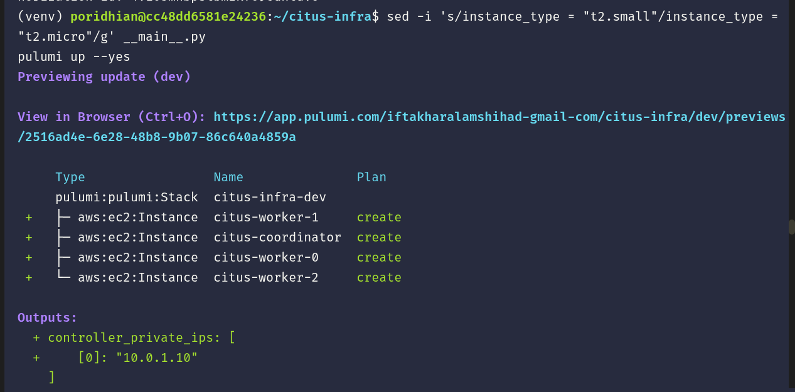
</p>

Pulumi creates the 4 EC2 instances:

<p align="center">
  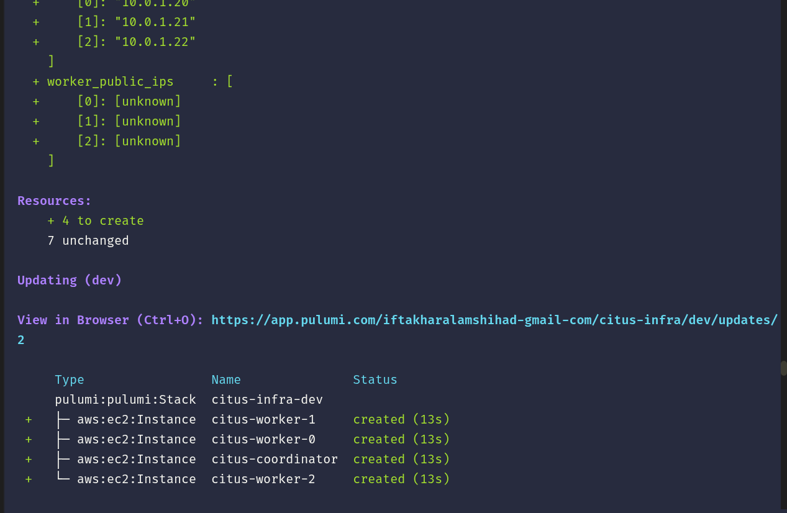
</p>

Once complete, Pulumi prints the public and private IPs:

<p align="center">
  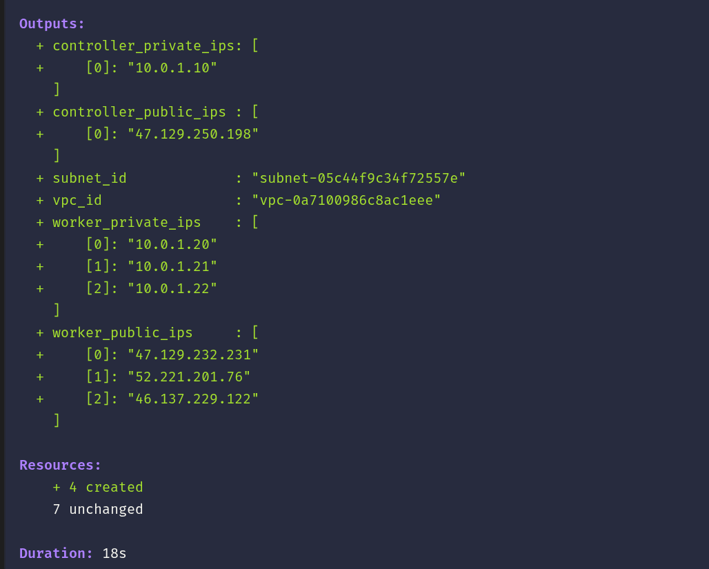
</p>

You can also view the active deployment in your browser on the Pulumi Cloud Dashboard:

<p align="center">
  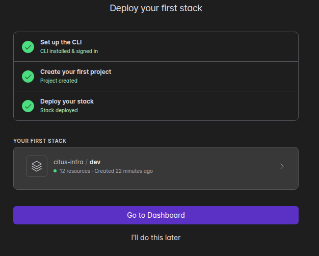
</p>

Inspect the generated SSH configuration file:

```bash
cat ~/.ssh/config
```

<p align="center">
  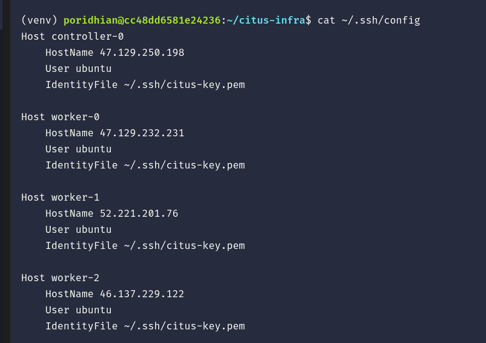
</p>

**Expected Output:**
```text
Host controller-0
    HostName 47.129.250.198
    User ubuntu
    IdentityFile ~/.ssh/citus-key.pem

Host worker-0
    HostName 47.129.232.231
    User ubuntu
    IdentityFile ~/.ssh/citus-key.pem

Host worker-1
    HostName 52.221.201.76
    User ubuntu
    IdentityFile ~/.ssh/citus-key.pem

Host worker-2
    HostName 46.137.229.122
    User ubuntu
    IdentityFile ~/.ssh/citus-key.pem
```

---

### Step 8: Create Docker Compose Files for Citus

Create two configurations: one for the coordinator and one for the workers.

#### 1. Coordinator Compose File:

```bash
cd ~/citus-infra

# 1. Coordinator Docker Compose
cat << 'EOF' > docker-compose-coordinator.yml
version: '3.8'
services:
  coordinator:
    image: citusdata/citus:12.1
    container_name: citus_coordinator
    ports:
      - "5432:5432"
    environment:
      - POSTGRES_PASSWORD=citus_password
      - POSTGRES_USER=citus
      - POSTGRES_DB=citus
    volumes:
      - coordinator_data:/var/lib/postgresql/data
    command: >
      -c citus.shard_replication_factor=2
      -c listen_addresses='*'
      -c wal_level=logical
volumes:
  coordinator_data:
EOF
```

<p align="center">
  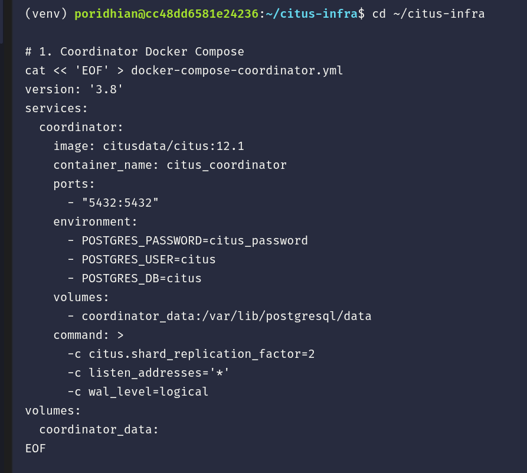
</p>

#### 2. Worker Compose File:

```bash
cd ~/citus-infra

cat << 'EOF' > docker-compose-worker.yml
version: '3.8'
services:
  worker:
    image: citusdata/citus:12.1
    container_name: citus_worker
    ports:
      - "5432:5432"
    environment:
      - POSTGRES_PASSWORD=citus_password
      - POSTGRES_USER=citus
      - POSTGRES_DB=citus
    volumes:
      - worker_data:/var/lib/postgresql/data
    command: >
      -c listen_addresses='*'
      -c wal_level=logical
volumes:
  worker_data:
EOF
```

<p align="center">
  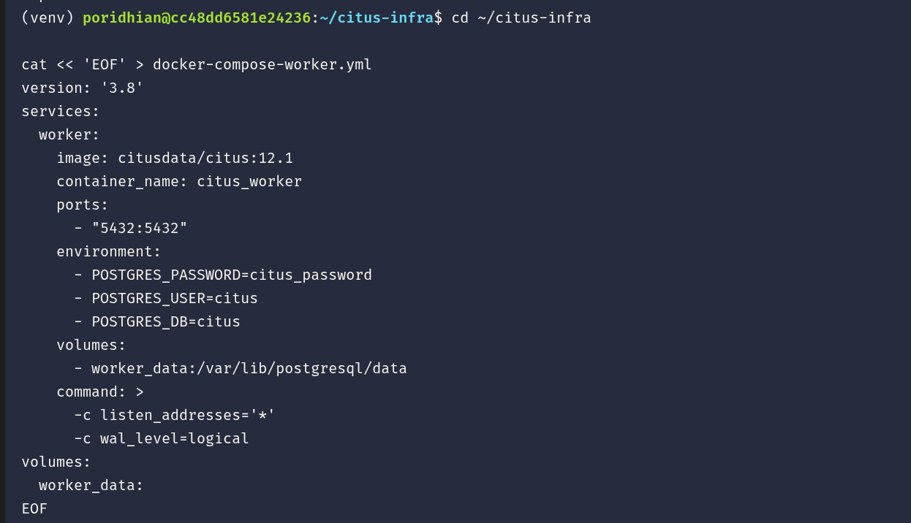
</p>

---

### Step 9: Transfer Compose Files to EC2 Nodes

#### 1. Transfer Coordinator Compose File:

Copy `docker-compose-coordinator.yml` to the Citus coordinator node (`controller-0`):

```bash
# Copy to Coordinator
scp -o StrictHostKeyChecking=no docker-compose-coordinator.yml controller-0:~
```

<p align="center">
  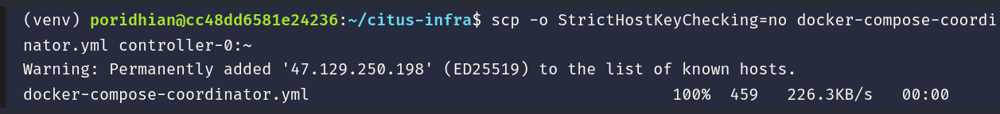
</p>

#### 2. Transfer Worker Compose Files:

Copy `docker-compose-worker.yml` to the 3 worker nodes (`worker-0`, `worker-1`, `worker-2`):

```bash
# Copy to Workers
scp -o StrictHostKeyChecking=no docker-compose-worker.yml worker-0:~
scp -o StrictHostKeyChecking=no docker-compose-worker.yml worker-1:~
scp -o StrictHostKeyChecking=no docker-compose-worker.yml worker-2:~
```

> [!TIP]
> If `scp` says `Connection refused` on the workers during the first try, wait 30 seconds for the EC2 operating systems to finish their initial SSH initialization and re-run.

<p align="center">
  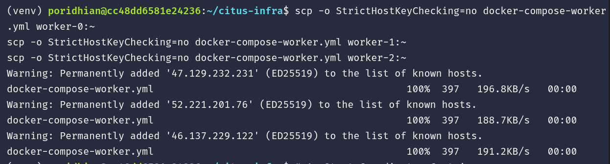
</p>

---

### Step 10: Start Citus Containers Across All Nodes

Launch the Dockerized Citus 12.1 containers in daemon mode on all 4 machines:

```bash
# 1. Start Coordinator Container
echo "=== Starting Coordinator on controller-0 ==="
ssh controller-0 "sudo docker-compose -f docker-compose-coordinator.yml up -d || sudo docker compose -f docker-compose-coordinator.yml up -d"

# 2. Start Worker Containers
echo "=== Starting Worker 0 ==="
ssh worker-0 "sudo docker-compose -f docker-compose-worker.yml up -d || sudo docker compose -f docker-compose-worker.yml up -d"

echo "=== Starting Worker 1 ==="
ssh worker-1 "sudo docker-compose -f docker-compose-worker.yml up -d || sudo docker compose -f docker-compose-worker.yml up -d"

echo "=== Starting Worker 2 ==="
ssh worker-2 "sudo docker-compose -f docker-compose-worker.yml up -d || sudo docker compose -f docker-compose-worker.yml up -d"
```

<p align="center">
  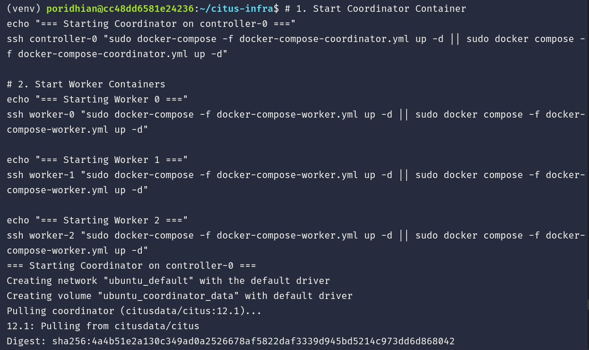
</p>

---

### Step 11: Register Worker Nodes into the Citus Cluster

SSH into `controller-0` and register the 3 worker nodes using their private VPC IPs (`10.0.1.20`, `10.0.1.21`, `10.0.1.22`):

```bash
ssh controller-0 << 'EOF'
sudo docker exec -i citus_coordinator psql -U citus -d citus << 'SQL'
SELECT citus_add_node('10.0.1.20', 5432);
SELECT citus_add_node('10.0.1.21', 5432);
SELECT citus_add_node('10.0.1.22', 5432);

-- Verify the cluster
SELECT * FROM citus_get_active_worker_nodes();
SQL
EOF
```

<p align="center">
  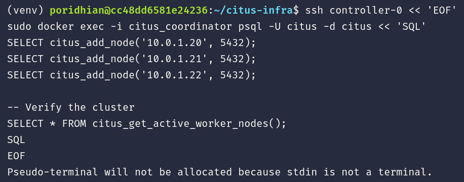
</p>

The coordinator verifies and displays all 3 active workers:

<p align="center">
  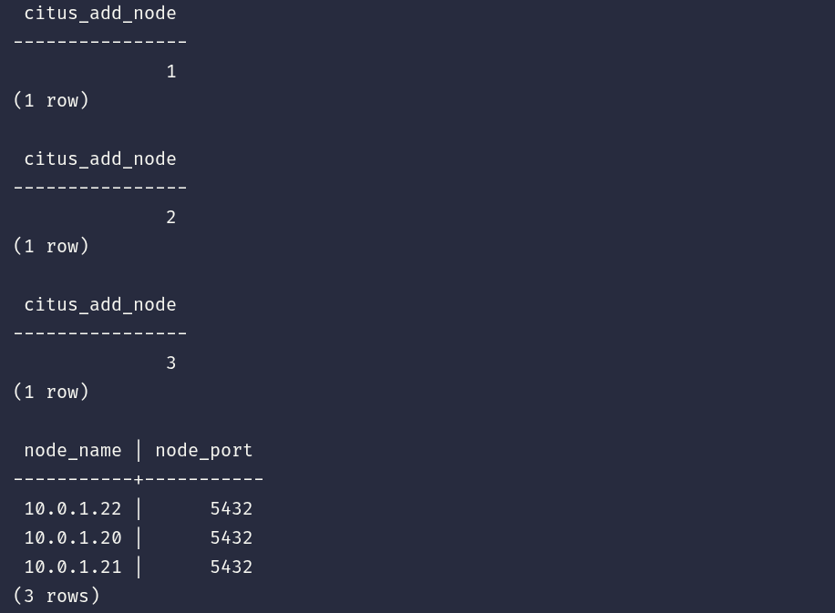
</p>

**Expected Output:**
```text
 citus_add_node 
----------------
              1
(1 row)

 citus_add_node 
----------------
              2
(1 row)

 citus_add_node 
----------------
              3
(1 row)

 node_name | node_port 
-----------+-----------
 10.0.1.22 |      5432 
 10.0.1.20 |      5432 
 10.0.1.21 |      5432 
(3 rows)
```

---

## Conclusion

Congratulations! You have provisioned and verified a production-grade distributed Citus PostgreSQL cluster:
- **1 Coordinator Node (`10.0.1.10`)**: Handles distributed planning, client SQL connections, and shard routing.
- **3 Worker Nodes (`10.0.1.20`, `10.0.1.21`, `10.0.1.22`)**: Store data shards and execute parallel queries.

You are now ready to proceed to **Lab 45: Flask–Citus Integration**!
