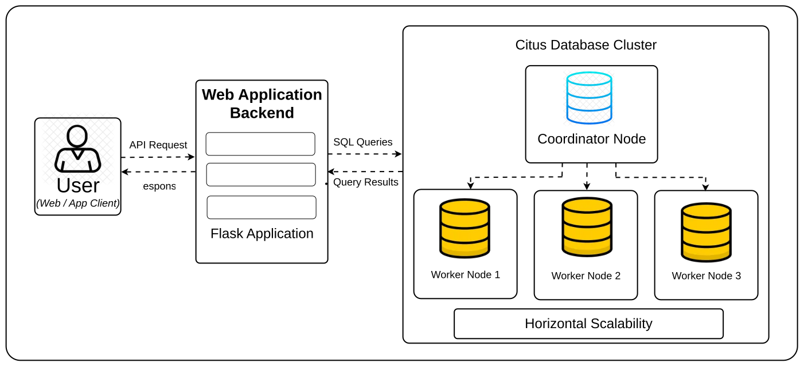
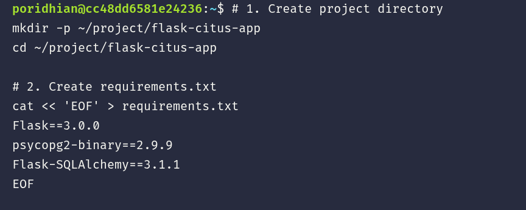
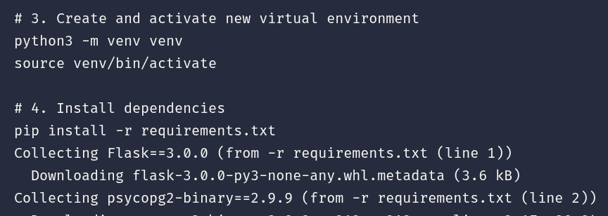
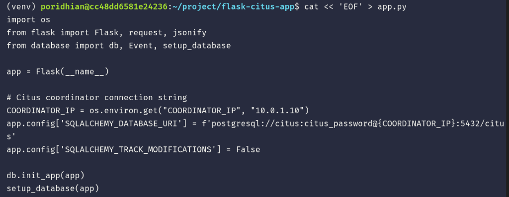
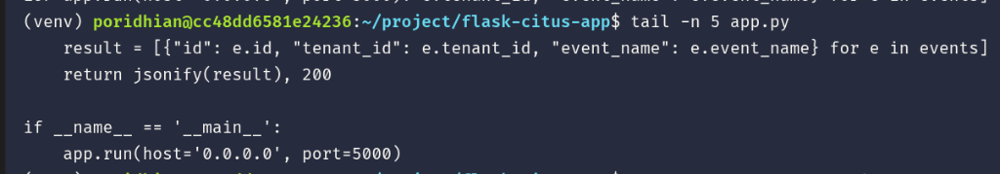
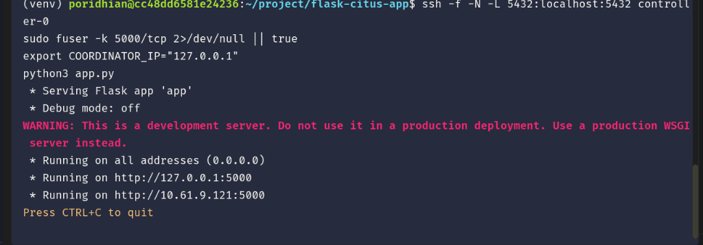
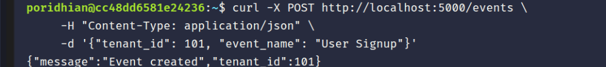
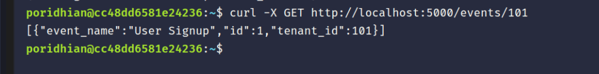

# Lab 45: Flask–Citus Integration

In this lab, you will build a Python REST API using Flask and SQLAlchemy that connects to a distributed Citus cluster. You will create endpoints to handle multi-tenant data, inserting and querying records across sharded tables. This demonstrates how a standard Flask application interacts seamlessly with Citus just like regular PostgreSQL.

<p align="center">
  
</p>

## Concept

| Term | Definition |
|---|---|
| **SQLAlchemy** | A SQL toolkit and Object-Relational Mapping (ORM) library for Python. |
| **Distribution Column** | The column used by Citus to shard data across worker nodes (e.g., `tenant_id`). |
| **Multi-tenant** | An architecture where a single instance of a software application serves multiple customers (tenants), isolated by a tenant ID. |

Citus is fully compatible with standard PostgreSQL drivers like `psycopg2`. This means your Flask application does not need any specialized Citus libraries to work. You simply define your models, mark the table as distributed by executing a specific Citus function (`create_distributed_table`), and ensure all queries include the distribution column to efficiently route them to the correct shards.

<p align="center">
  
</p>

---

## Objectives

- Verify or establish Citus cluster connectivity via Pulumi.
- Configure a Python virtual environment with Flask and SQLAlchemy.
- Implement a multi-tenant database model.
- Build REST endpoints to insert and retrieve sharded data.
- Verify distributed query execution and data insertion.

---

## Prerequisites: Citus Cluster Connectivity

Before launching the Flask application, verify that your Citus cluster coordinator (`controller-0`) is accessible:

```bash
ssh controller-0 "sudo docker ps"
```

> [!NOTE]
> - **If you already provisioned the cluster in Lab 44** in your current session, the command above will immediately return the running `citus_coordinator` container.
> - **If you are starting this lab in a fresh Poridhi terminal/container**, configure your AWS credentials and launch the cluster using Pulumi:
>   ```bash
>   aws configure set aws_access_key_id "YOUR_ACCESS_KEY_HERE"
>   aws configure set aws_secret_access_key "YOUR_SECRET_KEY_HERE"
>   aws configure set default.region "ap-southeast-1"
>   aws configure set default.output "json"
>
>   cd ~/citus-infra || (git clone https://github.com/poridhioss/distributed-postgresql-with-citus.git /tmp/citus-repo && cp -r /tmp/citus-repo/citus-infra ~/citus-infra && cd ~/citus-infra)
>   python3 -m venv venv && source venv/bin/activate
>   pip install -r requirements.txt
>   pulumi up --yes
>   ```

---

## Step 1: Project Setup and Dependencies Installation

Open **Terminal 1** and run the following commands to create the directory and define `requirements.txt`:

```bash
# 1. Create project directory
mkdir -p ~/project/flask-citus-app
cd ~/project/flask-citus-app

# 2. Create requirements.txt
cat << 'EOF' > requirements.txt
Flask==3.0.0
psycopg2-binary==2.9.9
Flask-SQLAlchemy==3.1.1
EOF
```

<p align="center">
  
</p>

Create an isolated Python virtual environment and install all required packages:

```bash
# 3. Create and activate new virtual environment
python3 -m venv venv
source venv/bin/activate

# 4. Install dependencies
pip install -r requirements.txt
```

<p align="center">
  
</p>

---

## Step 2: Implement Database Connection and Schema

In **Terminal 1**, create `database.py`. This defines the `Event` model and executes `create_distributed_table('events', 'tenant_id')` during table initialization:

```bash
cat << 'EOF' > database.py
from flask_sqlalchemy import SQLAlchemy
from sqlalchemy import text

db = SQLAlchemy()

class Event(db.Model):
    __tablename__ = 'events'
    
    id = db.Column(db.Integer, primary_key=True, autoincrement=True)
    tenant_id = db.Column(db.Integer, primary_key=True)
    event_name = db.Column(db.String(100), nullable=False)
    
def setup_database(app):
    with app.app_context():
        db.create_all()
        distribute_query = text("SELECT create_distributed_table('events', 'tenant_id');")
        try:
            db.session.execute(distribute_query)
            db.session.commit()
        except Exception:
            db.session.rollback()
            pass
EOF
```

---

## Step 3: Implement the Flask Application

In **Terminal 1**, create `app.py`:

```bash
cat << 'EOF' > app.py
import os
from flask import Flask, request, jsonify
from database import db, Event, setup_database

app = Flask(__name__)

# Citus coordinator connection string
COORDINATOR_IP = os.environ.get("COORDINATOR_IP", "127.0.0.1")
app.config['SQLALCHEMY_DATABASE_URI'] = f'postgresql://citus:citus_password@{COORDINATOR_IP}:5432/citus'
app.config['SQLALCHEMY_TRACK_MODIFICATIONS'] = False

db.init_app(app)
setup_database(app)

@app.route('/events', methods=['POST'])
def create_event():
    data = request.get_json()
    new_event = Event(
        tenant_id=data['tenant_id'],
        event_name=data['event_name']
    )
    db.session.add(new_event)
    db.session.commit()
    return jsonify({"message": "Event created", "tenant_id": new_event.tenant_id}), 201

@app.route('/events/<int:tenant_id>', methods=['GET'])
def get_events(tenant_id):
    events = Event.query.filter_by(tenant_id=tenant_id).all()
    result = [{"id": e.id, "tenant_id": e.tenant_id, "event_name": e.event_name} for e in events]
    return jsonify(result), 200

if __name__ == '__main__':
    app.run(host='0.0.0.0', port=5000)
EOF
```

<p align="center">
  
</p>

Verify that `app.py` was created completely:

```bash
tail -n 5 app.py
```

<p align="center">
  
</p>

---

## Step 4: Start the Flask API with Citus Connection

The Citus Coordinator EC2 instance runs at private IP `10.0.1.10` inside the AWS VPC. Establish a background SSH tunnel to `controller-0` forwarding port 5432, clean up port 5000, set `COORDINATOR_IP="127.0.0.1"`, and launch the Flask application:

```bash
# 1. Establish background SSH tunnel forwarding port 5432 to coordinator
ssh -f -N -L 5432:localhost:5432 controller-0

# 2. Clean up port 5000
sudo fuser -k 5000/tcp 2>/dev/null || true

# 3. Set localhost coordinator IP and start Flask app
export COORDINATOR_IP="127.0.0.1"
python3 app.py
```

<p align="center">
  
</p>

**Expected Output:**
```text
 * Serving Flask app 'app'
 * Debug mode: off
WARNING: This is a development server. Do not use it in a production deployment.
 * Running on all addresses (0.0.0.0)
 * Running on http://127.0.0.1:5000
 * Running on http://10.61.9.121:5000
Press CTRL+C to quit
```

*(Leave this running in Terminal 1).*

---

## Step 5: Test the API and Verify Sharding

Open **Terminal 2** to test the API endpoints using `curl`.

### 1. Insert Events for Tenant 1:
```bash
curl -s -X POST http://localhost:5000/events \
     -H "Content-Type: application/json" \
     -d '{"tenant_id": 1, "event_name": "login"}'
echo ""
```

<p align="center">
  
</p>

**Expected Output:**
```json
{"message":"Event created","tenant_id":1}
```

---

### 2. Insert Events for Tenant 2:
```bash
curl -s -X POST http://localhost:5000/events \
     -H "Content-Type: application/json" \
     -d '{"tenant_id": 2, "event_name": "page_view"}'
echo ""
```

**Expected Output:**
```json
{"message":"Event created","tenant_id":2}
```

---

### 3. Query Events by Specific Tenant ID:
```bash
curl -s -X GET http://localhost:5000/events/1
echo ""
```

<p align="center">
  
</p>

**Expected Output:**
```json
[{"event_name":"login","id":1,"tenant_id":1}]
```

---

### 4. Direct Database Query via Citus Coordinator:
Verify directly inside the PostgreSQL coordinator container that the table was created and sharded:

```bash
ssh controller-0 "sudo docker exec -i citus_coordinator psql -U citus -d citus -c 'SELECT * FROM events;'"
```

**Expected Output:**
```text
 id | tenant_id | event_name 
----+-----------+------------
  1 |         1 | login
  2 |         2 | page_view
(2 rows)
```

---

## Conclusion

You have successfully integrated a Flask REST API with a distributed Citus PostgreSQL cluster:
- Established a secure SSH tunnel to the private coordinator node.
- Defined a multi-tenant SQLAlchemy model with Citus table distribution (`events` table sharded on `tenant_id`).
- Verified seamless data routing and retrieval through standard REST endpoints.

You are now ready to proceed to **Lab 46: Distributed Schema Design**!
