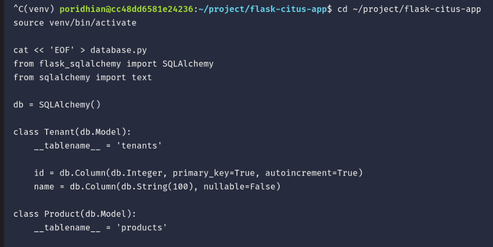
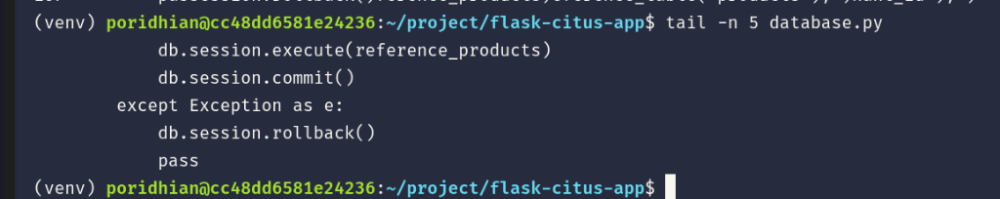
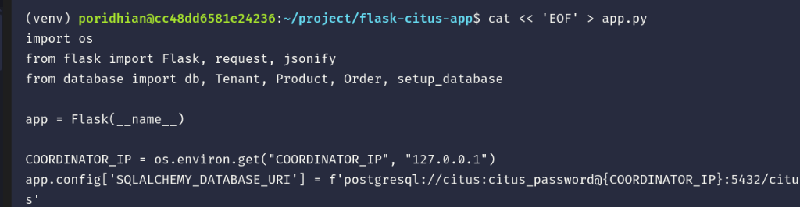
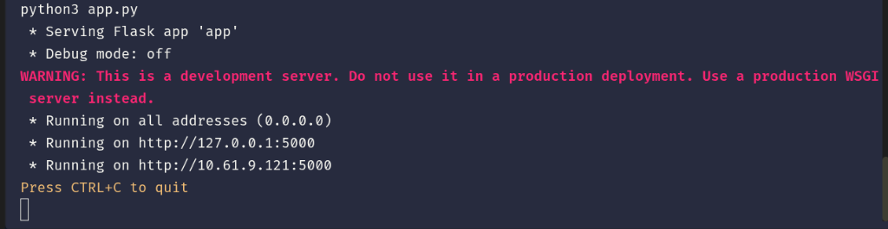
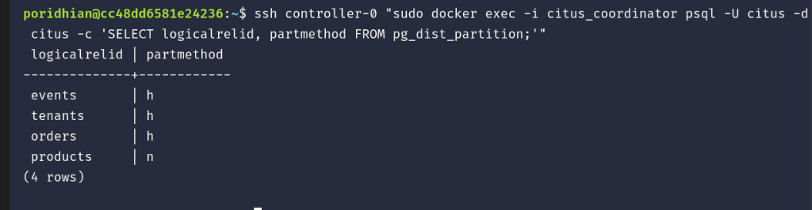

# Lab 46: Distributed Schema Design

In this lab, you will design a distributed database schema suitable for a multi-tenant application using Citus. You will learn the difference between distributed tables and reference tables, define SQLAlchemy models for `tenants`, `products`, and `orders`, and configure Citus to shard the `orders` table while keeping the `products` table available on all nodes as a reference table for global lookups.

<p align="center">
  
</p>

## Concept

| Term | Definition |
|---|---|
| **Distributed Table** | A table whose data is horizontally partitioned (sharded) across multiple worker nodes based on a distribution column (e.g., `tenant_id` or `id`). Ideal for large, frequently updated tables. |
| **Reference Table** | A table whose data is fully replicated to all worker nodes. Ideal for small, frequently joined lookup tables (e.g., product catalogs, country lists). |

In a multi-tenant e-commerce system, tables like `orders` grow rapidly and are always accessed in the context of a specific tenant. These should be distributed tables. Conversely, a `products` catalog might be shared across all tenants and is relatively small. Making `products` a reference table allows Citus to join `orders` and `products` locally on the worker nodes without network overhead.

---

## Objectives

- Verify or establish Citus cluster connectivity via Pulumi.
- Configure an isolated Python environment and connect securely via an SSH tunnel.
- Define SQLAlchemy models for `tenants`, `products`, and `orders`.
- Use `create_distributed_table` for the `tenants` and `orders` tables.
- Use `create_reference_table` for the `products` table.
- Verify partitioning and replication strategy using Citus system catalogs.

---

## Prerequisites: Citus Cluster Connectivity

Before proceeding with this lab, verify that the Citus Coordinator (`controller-0`) is accessible:

```bash
ssh controller-0 "sudo docker ps"
```

> [!NOTE]
> - **If you already provisioned the cluster in Lab 44** in your current session, the command above will immediately succeed.
> - **If you are in a fresh Poridhi terminal/container**, configure AWS CLI and launch the Citus cluster using Pulumi:
>   ```bash
>   aws configure set aws_access_key_id "YOUR_ACCESS_KEY_HERE"
>   aws configure set aws_secret_access_key "YOUR_SECRET_KEY_HERE"
>   aws configure set default.region "ap-southeast-1"
>   aws configure set default.output "json"
>
>   cd ~/citus-infra || (git clone https://github.com/poridhioss/distributed-postgresql-with-citus.git /tmp/citus-repo && cp -r /tmp/citus-repo/citus-infra ~/citus-infra && cd ~/citus-infra)
>   python3 -m venv venv && source venv/bin/activate
>   pip install -r requirements.txt
>   pulumi up --yes
>   ```

---

## Step 1: Project Setup and Dependencies Installation

Open **Terminal 1** and set up the isolated project directory and virtual environment:

```bash
# 1. Create and navigate into the project directory
mkdir -p ~/project/flask-citus-app
cd ~/project/flask-citus-app

# 2. Define requirements.txt
cat << 'EOF' > requirements.txt
Flask==3.0.0
psycopg2-binary==2.9.9
Flask-SQLAlchemy==3.1.1
EOF

# 3. Create and activate a Python virtual environment
python3 -m venv venv
source venv/bin/activate

# 4. Install dependencies
pip install -r requirements.txt
```

---

## Step 2: Establish SSH Tunnel to Citus Coordinator

The Citus Coordinator runs inside the AWS VPC on EC2 instance `controller-0` at port `5432`. Establish the background SSH tunnel forwarding port `5432` to localhost:

```bash
ssh -f -N -L 5432:localhost:5432 controller-0
```

---

## Step 3: Define Distributed Database Models

In **Terminal 1**, create `database.py` to define the multi-tenant schema:

```bash
cat << 'EOF' > database.py
from flask_sqlalchemy import SQLAlchemy
from sqlalchemy import text

db = SQLAlchemy()

class Tenant(db.Model):
    __tablename__ = 'tenants'
    
    id = db.Column(db.Integer, primary_key=True, autoincrement=True)
    name = db.Column(db.String(100), nullable=False)

class Product(db.Model):
    __tablename__ = 'products'
    
    id = db.Column(db.Integer, primary_key=True, autoincrement=True)
    name = db.Column(db.String(100), nullable=False)
    price = db.Column(db.Float, nullable=False)

class Order(db.Model):
    __tablename__ = 'orders'
    
    id = db.Column(db.Integer, primary_key=True, autoincrement=True)
    tenant_id = db.Column(db.Integer, primary_key=True)
    product_id = db.Column(db.Integer, nullable=False)
    quantity = db.Column(db.Integer, nullable=False)

def setup_database(app):
    with app.app_context():
        db.create_all()
        
        # Distribute tenants and orders
        distribute_tenants = text("SELECT create_distributed_table('tenants', 'id');")
        distribute_orders = text("SELECT create_distributed_table('orders', 'tenant_id');")
        
        # Make products a reference table
        reference_products = text("SELECT create_reference_table('products');")
        
        try:
            db.session.execute(distribute_tenants)
            db.session.execute(distribute_orders)
            db.session.execute(reference_products)
            db.session.commit()
        except Exception as e:
            # Tables might already be distributed/referenced
            db.session.rollback()
            pass
EOF
```

<p align="center">
  
</p>

Verify that `database.py` wrote cleanly:

```bash
tail -n 5 database.py
```

<p align="center">
  
</p>

---

## Step 4: Configure Flask Application

In **Terminal 1**, update `app.py` so it imports the new models (`Tenant`, `Product`, `Order`):

```bash
cat << 'EOF' > app.py
import os
from flask import Flask, request, jsonify
from database import db, Tenant, Product, Order, setup_database

app = Flask(__name__)

COORDINATOR_IP = os.environ.get("COORDINATOR_IP", "127.0.0.1")
app.config['SQLALCHEMY_DATABASE_URI'] = f'postgresql://citus:citus_password@{COORDINATOR_IP}:5432/citus'
app.config['SQLALCHEMY_TRACK_MODIFICATIONS'] = False

db.init_app(app)
setup_database(app)

if __name__ == '__main__':
    app.run(host='0.0.0.0', port=5000)
EOF
```

<p align="center">
  
</p>

Verify that `app.py` was created completely:

```bash
tail -n 5 app.py
```

---

## Step 5: Initialize Database and Start App

In **Terminal 1**, release port 5000 if occupied, and start the Flask app. This invokes `setup_database(app)`, executing `create_distributed_table` and `create_reference_table` in Citus:

```bash
sudo fuser -k 5000/tcp 2>/dev/null || true
export COORDINATOR_IP="127.0.0.1"
python3 app.py
```

<p align="center">
  
</p>

**Expected Output:**
```text
 * Serving Flask app 'app'
 * Debug mode: off
WARNING: This is a development server. Do not use it in a production deployment.
 * Running on all addresses (0.0.0.0)
 * Running on http://127.0.0.1:5000
 * Running on http://10.61.9.121:5000
Press CTRL+C to quit
```

*(Leave this running in Terminal 1).*

---

## Step 6: Verification via Citus Coordinator

Connect directly to the Citus coordinator container on `controller-0` to verify that the tables were created and distributed correctly.

Open **Terminal 2** and run the following command to check Citus distribution catalog (`pg_dist_partition`):

```bash
ssh controller-0 "sudo docker exec -i citus_coordinator psql -U citus -d citus -c 'SELECT logicalrelid, partmethod FROM pg_dist_partition;'"
```

<p align="center">
  
</p>

**Expected Output:**
```text
 logicalrelid | partmethod 
--------------+------------
 events       | h
 tenants      | h
 orders       | h
 products     | n
(4 rows)
```

| Output Type | Partition Method | Architecture Meaning |
|---|---|---|
| `h` | Hash Distributed | Data is horizontally sharded across Citus worker nodes based on a hash of the distribution column. |
| `n` | None (Reference Table) | Data is fully replicated to all worker nodes for local zero-network joins. |

Check the human-readable summary view via `citus_tables`:

```bash
ssh controller-0 "sudo docker exec -i citus_coordinator psql -U citus -d citus -c 'SELECT table_name, citus_table_type FROM citus_tables;'"
```

**Expected Output:**
```text
 table_name | citus_table_type 
------------+------------------
 events     | distributed
 tenants    | distributed
 orders     | distributed
 products   | reference
(4 rows)
```

---

## Conclusion

Congratulations! You have successfully designed a distributed schema with Citus using Flask and SQLAlchemy:
- **`tenants`**: Sharded across worker nodes by `id`.
- **`orders`**: Sharded across worker nodes by `tenant_id` for multi-tenant isolation and scaling.
- **`products`**: Replicated to every worker node as a reference table for fast joins.

You are now ready to proceed to **Lab 47: Sharded Data API**!
